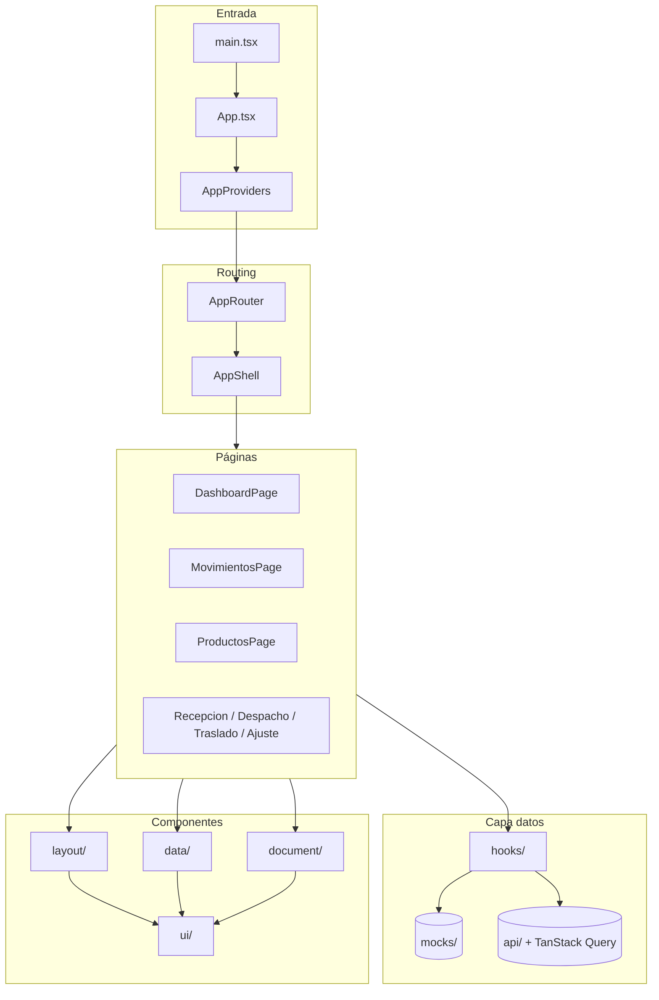

# Documento 10 — Frontend BodegaX: migración y estado actual

**Proyecto:** Sistema de Bodega e Inventario (sys_bod_inv)  
**Carpeta:** `frontend/`  
**Origen visual:** `Proyecto/` (HTML/CSS/JS monolítico con hash router)  
**Estado:** Fases 0–10 completadas + Fase API 1 (`/productos`)  
**Última actualización:** junio 2026

---

## 1. Resumen ejecutivo

Se migró la interfaz de **BodegaX** desde el prototipo estático en `Proyecto/` hacia una aplicación **React 19 + TypeScript + Vite 8 + Tailwind CSS 3 + React Router 7**, manteniendo la identidad visual del diseño original (tokens, tipografía, layout de shell, contratos de scroll).

El trabajo se organizó en **fases incrementales**: primero infraestructura y design system, luego shell y rutas, capa de datos reutilizable, pantallas funcionales con mocks, patrón de documentos operativos, y por último la **primera integración real con Django REST Framework** en el listado de productos.

| Área | Estado |
|------|--------|
| Design tokens y primitivos UI | ✅ Completo |
| Shell (sidebar, topbar, layout) | ✅ Completo |
| Router y navegación | ✅ Completo |
| Dashboard (mock) | ✅ Funcional |
| Listado movimientos (mock) | ✅ Funcional |
| Listado productos | ✅ API real + fallback mocks |
| Documentos (recepción, despacho, traslado, ajuste) | ✅ UI completa sobre mocks |
| Detalle movimiento | ⏳ Esqueleto |
| Auth UI / login | ⏳ Pendiente |
| Resto de endpoints API | ⏳ Pendiente |

---

## 2. Stack tecnológico

| Tecnología | Versión / uso |
|------------|---------------|
| React | 19.x |
| TypeScript | ~6.0 |
| Vite | 8.x |
| Tailwind CSS | 3.4 |
| React Router | 7.x |
| TanStack Query | 5.x (solo `/productos` por ahora) |
| class-variance-authority | Variantes de componentes |
| clsx + tailwind-merge | Utilidad `cn()` |

**Backend esperado:** Django + DRF en `http://127.0.0.1:8000`, prefijo API `/api/v1/`. En desarrollo, Vite hace proxy de `/api/v1` al backend.

---

## 3. Arranque y scripts

### Requisitos

- Node.js 20+
- Backend Django (opcional para mocks; obligatorio para API real en productos)

### Comandos

```bash
cd frontend
cp .env.example .env
npm install
npm run dev      # http://localhost:5173
npm run build    # tsc + vite build
npm run preview  # preview del build
npm run lint     # oxlint
```

### Variables de entorno (`.env`)

| Variable | Default | Descripción |
|----------|---------|-------------|
| `VITE_API_BASE_URL` | `/api/v1` | Base URL de la API |
| `VITE_USE_API_MOCKS` | `true` | Si `true`, `/productos` usa mocks locales |
| `VITE_API_ACCESS_TOKEN` | vacío | JWT Bearer para llamadas autenticadas |

Detalle de integración API productos: `frontend/src/api/README.md`.

---

## 4. Fases de implementación

### Fase 0 — Scaffold

- Proyecto Vite + React + TypeScript en `frontend/`
- Alias `@/` → `src/`
- Proxy dev `/api/v1` → Django
- Página home con demo de scroll interno

### Fase 1 — Design tokens

- `src/styles/tokens.css` — variables CSS (colores, espaciado, sombras, sidebar)
- `tailwind.config.ts` referencia tokens (no valores sueltos en componentes)
- Ruta `/dev/tokens` — validación visual de paleta y layout tokens
- `src/styles/globals.css` — reset, tipografía, contrato `overflow-hidden` en viewport

### Fase 2 — Primitivos UI

11 componentes en `src/components/ui/`:

| Componente | Archivo |
|------------|---------|
| Alert | `Alert.tsx` |
| Badge | `Badge.tsx` |
| Button | `Button.tsx` |
| EmptyState | `EmptyState.tsx` |
| ErrorState | `ErrorState.tsx` |
| Input | `Input.tsx` |
| Label | `Label.tsx` |
| LoadingState / Spinner | `LoadingState.tsx` |
| Panel (+ Header, Body, Title) | `Panel.tsx` |
| Select | `Select.tsx` |
| Textarea | `Textarea.tsx` |

Estilos: `src/styles/primitives.css` (clases `bx-*`).  
Catálogo: `/dev/components`.

### Fase 3 — Shell modular

Componentes en `src/components/layout/`:

| Componente | Responsabilidad |
|------------|-----------------|
| **AppShell** | Orquesta Sidebar + Topbar + MainContent |
| **Sidebar** | Nav principal, drawer móvil, `NavLink` activo |
| **Topbar** | Título/meta de ruta, toggle menú, badge operativo |
| **MainContent** | Área scrollable, reset al cambiar ruta |
| **PageHeader** | Breadcrumbs, eyebrow, título, lead, acciones |
| **Breadcrumbs** | Migas con `Link` |

Config: `config/chrome.ts`, `config/navigation.ts`, `lib/breadcrumbs.ts`.  
Preview: `/dev/layout`.

### Fase 4 — Router y páginas esqueleto

- `src/app/router.tsx` — rutas dentro de `AppShell`
- `src/config/routes.ts` — `ROUTES`, `APP_MAIN_ROUTES`, tipos
- 8 rutas principales + rutas `/dev/*`
- `pages/AppPageSkeleton.tsx` — plantilla base para pantallas vacías
- Índice: `/dev/routes`

### Fase 5 — Capa de datos + Dashboard

Componentes en `src/components/data/`:

| Componente | Responsabilidad |
|------------|-----------------|
| **StatCard** | KPI (variantes hero, accent, inset, dark) |
| **FilterBar** | Barra de filtros con `FilterBar.Field` |
| **DataTable** | Tabla genérica tipada |
| **ScrollableTable** | DataTable + scroll interno (`height`) |
| **Pagination** | Paginación con rango “1–6 de 42” |
| **DataView** | Orquesta loading / error / empty / success |

Estilos: `src/styles/data.css`.

- `mocks/dashboard.ts` + `hooks/useDashboardData.ts`
- `pages/DashboardPage.tsx` funcional con mocks
- Textos UI: `config/data-ui.ts`
- Catálogo: `/dev/data`

### Fase 6 — Listados paginados (mocks)

- `hooks/usePaginatedMockList.ts` — filtros draft/aplicados, paginación, estados simulados (~550 ms)
- `config/filter-options.ts` — opciones de filtros UI
- **`/movimientos`** — `MovimientosPage` + `mocks/movements.ts`
- **`/productos`** — `ProductosPage` + `mocks/products.ts` (6 filas/página)

Patrón listado:

```
PageHeader → FilterBar → DataView → Panel → ScrollableTable + Pagination
```

### Fase 7 — Recepción (documento)

Patrón de **documento operativo** introducido:

- Componentes: `src/components/document/` (`DocLayout`, `FormSection`, `FormField`, `DocInfoStrip`, `DocMetaRow`, `DocSummary`, `QtyControl`)
- Estilos: `src/styles/document.css`
- Mock: `mocks/documents/recepcion.ts` — **REC-0089**
- Hook: `hooks/useRecepcionDocument.ts`
- Config textos: `config/document-ui.ts`
- Pantalla: `/recepcion`
- Dev: `/dev/document`

### Fase 8 — Despacho

- Mock: `mocks/documents/despacho.ts` — **DES-0034**
- Hook: `hooks/useDespachoDocument.ts`
- Pantalla: `/despacho`
- Mismo patrón visual que recepción; campos específicos de despacho

### Fase 9 — Traslado

- Mock: `mocks/documents/traslado.ts` — **TRA-0012**
- Hook: `hooks/useTrasladoDocument.ts`
- Pantalla: `/traslado`
- Cabecera sin bodega única (`Omit<DocumentHeaderBase, 'warehouse'>`); origen/destino en strip

### Fase 10 — Ajuste

- Mock: `mocks/documents/ajuste.ts` — **AJU-0005**
- Hook: `hooks/useAjusteDocument.ts`
- Pantalla: `/ajuste`
- Líneas con stock teórico / físico / diferencia calculada
- Tipos de ajuste: sobrante, faltante, rotura, inventario físico
- Alerta de aprobación cuando hay líneas en revisión

### Fase API 1 — Productos con DRF + TanStack Query

Única pantalla conectada a API real:

| Archivo | Rol |
|---------|-----|
| `src/api/client.ts` | Fetch, Bearer JWT, `ApiError` / `NetworkError` |
| `src/api/types.ts` | `PaginatedResponse`, `PaginatedResult` |
| `src/api/products.ts` | `fetchProducts()`, adaptador → `ProductRow` |
| `src/hooks/useProductosList.ts` | TanStack Query + misma interfaz que el hook mock |
| `src/app/providers.tsx` | `QueryClientProvider` + `BrowserRouter` |

**Endpoints usados:**

- `GET /api/v1/inventory/productos/` — listado paginado
- `GET /api/v1/catalogs/categorias/` — resolver filtro categoría
- `GET /api/v1/inventory/stock/?product={id}` — enriquecer stock y ubicación

**Fallback:** si `VITE_USE_API_MOCKS=true` o error de red → `queryProducts()` de mocks. Errores HTTP (401, 500) muestran estado error con Reintentar.

---

## 5. Mapa de rutas

### Rutas de aplicación

| Ruta | Pantalla | Estado | Fuente de datos |
|------|----------|--------|-----------------|
| `/` | Home (demo scroll) | ✅ | Estático |
| `/dashboard` | Dashboard | ✅ | Mock |
| `/movimientos` | Historial movimientos | ✅ | Mock |
| `/movimiento-detalle` | Detalle movimiento | ⏳ Esqueleto | Demo MOV-0042 |
| `/productos` | Catálogo productos | ✅ | **API o mock** |
| `/recepcion` | Recepción | ✅ | Mock REC-0089 |
| `/despacho` | Despacho | ✅ | Mock DES-0034 |
| `/traslado` | Traslado | ✅ | Mock TRA-0012 |
| `/ajuste` | Ajuste inventario | ✅ | Mock AJU-0005 |

### Rutas de desarrollo (`/dev/*`)

| Ruta | Propósito |
|------|-----------|
| `/dev/tokens` | Paleta y tokens CSS |
| `/dev/components` | Catálogo primitivos UI |
| `/dev/layout` | Preview shell |
| `/dev/routes` | Índice rutas principales |
| `/dev/data` | Componentes de datos |
| `/dev/document` | Componentes de documento + links a pantallas |

Navegación sidebar: `config/navigation.ts` (grupos Principal y Documentos + enlaces dev en sidebar).

---

## 6. Estructura de carpetas

```
frontend/
├── .env.example
├── package.json
├── vite.config.ts
├── tailwind.config.ts
└── src/
    ├── api/                 # Cliente HTTP, productos (Fase API 1)
    ├── app/
    │   ├── providers.tsx    # QueryClient + Router
    │   └── router.tsx
    ├── components/
    │   ├── data/            # StatCard, FilterBar, DataTable, DataView, …
    │   ├── document/        # DocLayout, FormSection, QtyControl, …
    │   ├── layout/          # AppShell, Sidebar, Topbar, PageHeader, …
    │   └── ui/              # Primitivos
    ├── config/
    │   ├── chrome.ts        # Metadatos por ruta (topbar, PageHeader)
    │   ├── dashboard-actions.tsx
    │   ├── data-ui.ts       # Textos listados y DataView
    │   ├── document-ui.ts   # Textos documentos
    │   ├── env.ts           # Variables Vite
    │   ├── filter-options.ts
    │   ├── list-actions.tsx
    │   ├── navigation.ts
    │   ├── routes.ts
    │   └── skeleton-actions.tsx
    ├── hooks/
    │   ├── useAjusteDocument.ts
    │   ├── useDashboardData.ts
    │   ├── useDespachoDocument.ts
    │   ├── usePaginatedMockList.ts
    │   ├── useProductosList.ts      # API + mocks
    │   ├── useRecepcionDocument.ts
    │   ├── useSidebar.tsx
    │   └── useTrasladoDocument.ts
    ├── lib/
    │   ├── breadcrumbs.ts
    │   └── cn.ts
    ├── mocks/
    │   ├── dashboard.ts
    │   ├── movements.ts
    │   ├── products.ts
    │   ├── status-labels.ts
    │   └── documents/
    │       ├── types.ts     # Badges documento/línea
    │       ├── recepcion.ts
    │       ├── despacho.ts
    │       ├── traslado.ts
    │       └── ajuste.ts
    ├── pages/               # Una página por ruta principal
    └── styles/
        ├── tokens.css       # ⚠️ No modificar sin acuerdo
        ├── globals.css
        ├── primitives.css
        ├── layout.css
        ├── data.css
        ├── document.css
        └── components.css
```

---

## 7. Contratos de UX y layout

### Scroll

Regla central heredada del prototipo `Proyecto/`:

1. **`html`, `body`, `#root`:** `overflow-hidden` — el viewport no hace scroll global.
2. **Páginas de listado:** `MainContent` hace scroll de página completa.
3. **Documentos operativos:** cabecera y acciones fijas; **solo el panel de líneas** hace scroll (`ScrollableTable` con `height="doc"`).
4. **Tablas largas:** `ScrollableTable` con `height="default" | "tall" | "dashboard" | "doc"`.
5. **Paneles:** `PanelBody scroll` + clases `bx-panel-scroll`.

### Estados de datos (`DataView`)

Todas las pantallas con carga asíncrona usan el mismo contrato:

| Estado | Comportamiento |
|--------|----------------|
| `loading` | Spinner + etiqueta (`DATA_UI`) |
| `empty` | Mensaje + acción “limpiar filtros” si aplica |
| `error` | Texto claro + botón **Reintentar** |
| `success` | Contenido (tabla, documento, etc.) |

### Patrón documento operativo

Estructura común en recepción, despacho, traslado y ajuste:

```
PageHeader (código + badge estado + acciones)
  ↓
DataView (loading / error)
  ↓
DocLayout
  ├── DocInfoStrip (meta visible)
  ├── FormSection (cabecera editable)
  ├── Panel
  │     └── ScrollableTable (líneas, height="doc", flush)
  ├── DocMetaRow
  ├── DocSummary
  └── Acciones footer (duplican header: Cancelar, Guardar borrador, Confirmar)
```

**Badges compartidos** (`mocks/documents/types.ts`):

- Documento: borrador, en_proceso, confirmado, pendiente, revisión
- Línea: ok, pendiente, diferencia, revisión

**Hooks documento:** carga simulada ~550 ms; guardar/confirmar ~900 ms; `isReadOnly` cuando estado = confirmado.

### Patrón listado paginado

```
PageHeader
FilterBar (draft filters + Aplicar / Limpiar)
DataView
  Panel
    ScrollableTable (height="tall", flush)
    Pagination (page, pageSize, total)
```

Filtros: valor en draft hasta pulsar **Aplicar** (o Enter en búsqueda). Cambio de página no reaplica filtros draft.

---

## 8. Inventario de mocks

| Mock | Archivo | Uso |
|------|---------|-----|
| Dashboard KPIs y tablas | `mocks/dashboard.ts` | `/dashboard` |
| Movimientos | `mocks/movements.ts` | `/movimientos` |
| Productos | `mocks/products.ts` | `/productos` (fallback) |
| Badges stock/movimiento | `mocks/status-labels.ts` | Listados |
| Recepción REC-0089 | `mocks/documents/recepcion.ts` | `/recepcion` |
| Despacho DES-0034 | `mocks/documents/despacho.ts` | `/despacho` |
| Traslado TRA-0012 | `mocks/documents/traslado.ts` | `/traslado` |
| Ajuste AJU-0005 | `mocks/documents/ajuste.ts` | `/ajuste` |

---

## 9. Hooks personalizados

| Hook | Pantalla / uso |
|------|----------------|
| `useSidebar` | Estado drawer móvil |
| `useDashboardData` | Dashboard mock |
| `usePaginatedMockList` | Movimientos (genérico) |
| `useProductosList` | Productos (API + fallback mock) |
| `useRecepcionDocument` | Recepción |
| `useDespachoDocument` | Despacho |
| `useTrasladoDocument` | Traslado |
| `useAjusteDocument` | Ajuste |

---

## 10. Configuración centralizada

| Archivo | Contenido |
|---------|-----------|
| `routes.ts` | Constantes de rutas y lista principal |
| `navigation.ts` | Sidebar (Principal + Documentos + dev) |
| `chrome.ts` | `ROUTE_PAGE_META`, títulos topbar |
| `data-ui.ts` | Textos loading/error/empty de listados |
| `document-ui.ts` | Columnas, labels y alertas por tipo documento |
| `filter-options.ts` | Opciones de filtros (categoría, stock, tipo movimiento) |
| `list-actions.tsx` | Botones de cabecera en listados |
| `dashboard-actions.tsx` | Acciones dashboard |
| `skeleton-actions.tsx` | Botones deshabilitados en esqueletos |
| `env.ts` | `API_BASE_URL`, `USE_API_MOCKS`, `API_ACCESS_TOKEN` |

---

## 11. Integración API (estado actual)

### Autenticación

DRF usa **JWT** (`POST /api/v1/auth/token/`). El frontend envía `Authorization: Bearer <token>` vía `VITE_API_ACCESS_TOKEN`. No hay pantalla de login aún.

### Solo productos conectado

**Filtros UI → query params:**

| Filtro | Parámetro API |
|--------|---------------|
| Buscar | `search` |
| Categoría | `categoria` (id desde catálogo) |
| Estado stock | `stock` (`en_stock`, `stock_bajo`, `agotado`) |
| Paginación | `page`, `page_size=6` |

**Adaptación `ProductRow`:** el serializer de producto no incluye stock ni ubicación; se enriquecen consultando `/inventory/stock/` por cada producto de la página actual. Categoría se resuelve por nombre desde `/catalogs/categorias/`.

### Pendiente de API

- `/movimientos`
- `/dashboard`
- Documentos: `/recepcion`, `/despacho`, `/traslado`, `/ajuste`
- `/movimiento-detalle`
- Flujo auth completo (login, refresh, interceptores)
- `ConfirmDialog`, `ToastProvider` (mencionados en roadmap)

---

## 12. Reglas y restricciones seguidas

Durante la migración se respetaron estas reglas de proyecto:

1. **No modificar** `tokens.css` ni primitivos UI sin necesidad explícita.
2. **No cambiar** Tailwind config salvo referencias a tokens.
3. **Mocks como capa de desarrollo** hasta integración API por pantalla.
4. **Sin lógica de negocio nueva** en frontend en fases de UI — solo simulación visual o reflejo de datos del backend.
5. **Reutilizar patrones** — un listado y un documento como plantilla para el resto.
6. **Contrato scroll** — viewport fijo; scroll interno en tablas y paneles de documento.

---

## 13. Documentación complementaria en el repo

| Ubicación | Tema |
|-----------|------|
| `frontend/README.md` | Arranque rápido |
| `frontend/src/components/layout/README.md` | Shell y PageHeader |
| `frontend/src/components/data/README.md` | Listados y DataView |
| `frontend/src/components/document/README.md` | Documentos operativos |
| `frontend/src/components/ui/README.md` | Primitivos |
| `frontend/src/api/README.md` | API productos y variables env |

---

## 14. Próximas fases sugeridas

1. **Fase API 2** — `/movimientos` con DRF + TanStack Query (mismo patrón que productos).
2. **Fase API 3** — Auth UI + almacenamiento JWT + refresh automático.
3. **Fase API 4–7** — Documentos operativos conectados a endpoints `operations/`.
4. **Fase UI** — `/movimiento-detalle` funcional.
5. **Transversal** — `ConfirmDialog`, toasts, manejo global de errores API.

---

## 15. Referencia rápida — documentos demo

| Tipo | Código mock | Ruta | Estado mock |
|------|-------------|------|-------------|
| Recepción | REC-0089 | `/recepcion` | en_proceso |
| Despacho | DES-0034 | `/despacho` | borrador |
| Traslado | TRA-0012 | `/traslado` | pendiente |
| Ajuste | AJU-0005 | `/ajuste` | revisión |

---

## 16. Diagrama de arquitectura frontend



---

*Este documento consolida el trabajo de frontend realizado hasta la Fase 10 (documentos mock) y Fase API 1 (productos). Actualizar al cerrar cada nueva fase.*
