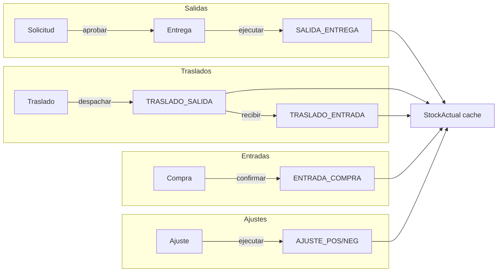

# Plan del proyecto — Sistema de Bodega e Inventario

Documento maestro de avance (backend) y hoja de ruta (frontend + cierres pendientes).  
Basado en documentos técnicos 01–10 y desarrollo por fases acordado.

**Última actualización:** junio 2026  
**Estado backend:** Fases 0–7 + endurecimiento API — **completado**  
**Estado frontend:** UI operativa con mocks + integración API parcial (Fases API 1–7: listados, dashboard, recepción, despacho y traslado)  
**Tests:** 58 passed, 1 skipped (concurrencia numerador requiere PostgreSQL)

---

## 1. Visión y alcance v1

Sistema **multiempresa** de bodega e inventario donde los **movimientos de inventario son la fuente de verdad** y el stock es cache derivado.

### Stack acordado

| Capa | Tecnología |
|------|------------|
| Backend | Django 5.x, DRF, PostgreSQL |
| Auth API | JWT (`rest_framework_simplejwt`) |
| Documentación API | drf-spectacular (OpenAPI 3 + Swagger UI) |
| Filtros listados | django-filter |
| Frontend (planificado) | React 19, TypeScript, Vite, Tailwind CSS 4, React Router 7, Axios |
| Tests | pytest, pytest-django |

### Incluido en v1

- Multiempresa con aislamiento estricto por `empresa_id`
- RBAC: 31 permisos, 5 roles demo
- Catálogos, productos (serializado / no serializado / por lote)
- Movimientos + stock cache + costeo **PROMEDIO_PONDERADO**
- Documentos: Solicitud, Entrega, Traslado, Compra, AjusteInventario
- API REST completa + Admin Django
- Seeds idempotentes (`load_initial_data`)

### Excluido de v1 (postergado)

- Ventas
- FIFO operativo (modelos preparados, servicio bloqueado)
- Recepción parcial de compras
- Adjuntos en UI (API existe, sin upload real en front)
- Frontend funcional (solo scaffold)
- FK directa de `MovimientoInventario` → documentos operations (usa `referencia_tipo` / `referencia_id`)

---

## 2. Decisiones técnicas cerradas

### Stock negativo

- **Default:** bloqueado.
- **Permitido solo si:** `ParametroEmpresa.stock_negativo_permitido` **Y** `Producto.permite_stock_negativo`, o `permitir_stock_negativo=True` en `MovimientoInput`.
- **Serializados:** nunca pueden quedar en stock negativo.

### Series y lotes por tipo de control

| Tipo | Serie | Lote | Cantidad |
|------|-------|------|----------|
| `SERIALIZADO` | Obligatoria, única | No | Siempre 1 |
| `NO_SERIALIZADO` | No | No | Libre |
| `POR_LOTE` | No | Obligatorio | Libre |

### Ubicación de modelos por app

| App | Contenido |
|-----|-----------|
| `core` | Empresa, Sucursal, Bodega, CentroCosto, ParametroEmpresa |
| `security` | Usuario, Rol, Permiso, UsuarioRol, RolPermiso |
| `catalogs` | Categoría, Marca, UnidadMedida, tipos/estados globales |
| `inventory` | Producto, Serie, Lote, Proveedor, MovimientoInventario, StockActual, capas FIFO |
| `operations` | Solicitud, Entrega, Traslado, Compra, AjusteInventario + detalles + historial |
| `support` | UbicacionBodega, Custodio, Numerador, Adjunto |

### Patrones de arquitectura

- **Lógica de negocio en `services/`**, no en views.
- **Views delgadas:** validación HTTP, permisos, delegación a services.
- **Movimientos como verdad;** `StockActual` es cache con locks (`select_for_update`).
- **Seeds idempotentes:** `catalogs/seeds.py`, `security/seeds.py`, `*/sync.py`, comando `load_initial_data`.

---

## 3. Backend completado — registro por fases

### Fase 0 — Infraestructura ✅

- Proyecto Django, `config/settings/{base,dev,prod}.py`
- `requirements.txt`, `.env.example`, `.gitignore`, `README.md`
- pytest (`pytest.ini`, `conftest.py`, `USE_SQLITE=1` en dev/tests)
- `AUTH_USER_MODEL = security.Usuario`

### Fase 1 — core + security ✅

- Modelos: Empresa, Sucursal, Bodega, CentroCosto, ParametroEmpresa
- Modelos: Usuario (email), Rol, Permiso, UsuarioRol, RolPermiso
- Admin + migraciones `core/0001`, `security/0001`

### Fase 2 — catalogs ✅

- 8 modelos de catálogo (globales + por empresa)
- `ParametroEmpresa.metodo_costeo` → FK a `catalogs.MetodoCosteo` (`core/0002`)
- 31 permisos RBAC + sync idempotente
- Tests: `catalogs/tests/test_catalogos.py`

### Fase 3 — support ✅

- UbicacionBodega, Custodio, Numerador, Adjunto
- `NumeradorService` con `select_for_update` (concurrencia)
- Migración `support/0001`

### Fase 4 — inventory (modelos) ✅

- Producto, Serie, Lote, Proveedor, MovimientoInventario, StockActual, capas FIFO
- Constraints parciales stock con/sin lote
- `referencia_tipo` / `referencia_id` en movimientos (sin FK a operations)
- Tests constraints: `inventory/tests/test_models.py`

### Fase 5 — inventory (services) ✅

Servicios en `inventory/services/`:

- `stock_service` — lock, validación stock negativo
- `serie_service` — estados, tránsito, recepción traslado
- `lote_service`, `valorizacion_service` (solo PROMEDIO_PONDERADO)
- `movimiento_inventario_service` — registrar / anular / entrada serializada

Tests: `inventory/tests/test_movimiento_service.py` (14 tests)

### Fase 6 — operations ✅

**Modelos:** Solicitud, Entrega, Traslado, Compra, AjusteInventario + detalles + EstadoHistorialDocumento

**Services:**

| Service | Flujo principal |
|---------|-----------------|
| `solicitud_service` | crear → enviar → aprobar / rechazar / anular / cerrar |
| `entrega_service` | desde solicitud / ad-hoc → ejecutar → `SALIDA_ENTREGA` |
| `traslado_service` | enviar → aprobar → despachar → recibir (`TRASLADO_*`, series EN_TRANSITO) |
| `compra_service` | enviar → aprobar → confirmar → `ENTRADA_COMPRA` |
| `ajuste_service` | conteo vs stock → aprobar → ejecutar (`AJUSTE_*`) |
| `documento_estado_service` | matriz de transiciones por tipo documento |

Migración: `operations/0001_initial`  
Tests E2E servicios: `operations/tests/test_flujos.py` (6 flujos + 1 API)

### Fase 7 — API REST + RBAC ✅

**Infraestructura API:**

- `security/services/permiso_service.py`
- `security/api/permissions.py` → `RBACPermission`
- `core/api/mixins.py` → `EmpresaScopedMixin`, `RBACViewMixin`, `StandardListMixin`
- JWT: `POST /api/v1/auth/token/`, `POST /api/v1/auth/token/refresh/`
- OpenAPI: `/api/schema/`, Swagger: `/api/docs/`
- Handler errores negocio → HTTP 400

**Módulos API:**

| Prefijo | Contenido |
|---------|-----------|
| `/api/v1/core/` | empresa, sucursales, bodegas, centros-costo, parametros |
| `/api/v1/catalogs/` | categorías, marcas, unidades + catálogos globales (lectura) |
| `/api/v1/inventory/` | productos, proveedores, stock, movimientos |
| `/api/v1/operations/` | solicitudes, entregas, traslados, compras, ajustes + acciones |
| `/api/v1/support/` | ubicaciones, custodios, numeradores, adjuntos |
| `/api/v1/security/` | me, usuarios, roles, permisos |

Tests API: `api_tests/` (aislamiento, permisos, flujos, schema)

### Endurecimiento API (post-Fase 7) ✅

- **`EmpresaScopedPrimaryKeyRelatedField`** — rechaza FKs de otra empresa (400)
- **`EmpresaScopedModelSerializer`** — querysets FK acotados en CRUD maestros
- **Paginación:** `?page=`, `?page_size=` (máx. 100)
- **Filtros django-filter** por recurso (`?activo=`, `?bodega=`, `?estado_codigo=`, etc.)
- **Búsqueda:** `?search=`
- **Orden:** `?ordering=` / `?ordering=-campo`
- Validación schema: `python manage.py spectacular --validate`

---

## 4. RBAC — roles y permisos (referencia)

### Roles demo (`load_initial_data`)

| Rol | Perfil |
|-----|--------|
| `ADMIN` | Todos los permisos |
| `BODEGUERO` | Operación diaria: productos, stock, crear/ejecutar documentos operativos |
| `SUPERVISOR` | Bodeguero + aprobaciones, ajustes, anular, override stock negativo |
| `APROBADOR` | Solo aprobar solicitudes, entregas ad-hoc, traslados, compras, ajustes |
| `CONSULTA` | Solo lectura stock/productos/movimientos |

### Permisos clave por módulo

- **core:** `core.empresa.ver`, `core.bodega.ver/editar`, `core.parametro.editar`
- **catalogs:** `catalogs.ver`, `catalogs.editar`
- **inventory:** `inventory.producto.ver/editar`, `inventory.stock.ver`, `inventory.movimiento.ver`, `inventory.proveedor.editar`, `inventory.aprobar_ajuste`, `inventory.override_stock_negativo`
- **operations:** `operations.solicitud.crear/aprobar`, `operations.entrega.crear/aprobar`, `operations.traslado.*`, `operations.compra.*`, `operations.documento.anular`
- **support:** `support.adjunto.subir`, `support.numerador.editar`
- **security:** `security.usuario.ver/editar`, `security.rol.editar`

Fuente: `security/seeds.py` + `core/management/commands/load_initial_data.py`

---

## 5. API — convenciones para el frontend

### Autenticación

```http
POST /api/v1/auth/token/
Content-Type: application/json

{"email": "usuario@empresa.cl", "password": "..."}
```

Respuesta: `{ "access": "...", "refresh": "..." }`  
Header en requests: `Authorization: Bearer <access>`

### Listados estándar

```http
GET /api/v1/inventory/productos/?page=1&page_size=25&search=SKU&activo=true&ordering=sku
```

Respuesta paginada:

```json
{
  "count": 120,
  "next": "...",
  "previous": null,
  "results": [ ... ]
}
```

### Permisos del usuario logueado

```http
GET /api/v1/security/me/
```

Respuesta incluye array `permisos` con códigos RBAC → usar para mostrar/ocultar acciones en UI.

### Documentos operations — patrón de acciones

| Documento | Crear | Detalle | Workflow |
|-----------|-------|---------|----------|
| Solicitud | `POST /solicitudes/` | `POST /solicitudes/{id}/detalles/` | enviar → aprobar |
| Entrega | `POST /entregas/desde-solicitud/` o `/ad-hoc/` | `POST /entregas/{id}/detalles/` | ejecutar |
| Traslado | `POST /traslados/` | `POST /traslados/{id}/detalles/` | enviar → aprobar → despachar → recibir |
| Compra | `POST /compras/` | `POST /compras/{id}/detalles/` | enviar → aprobar → confirmar |
| Ajuste | `POST /ajustes/` | `POST /ajustes/{id}/detalles/` | enviar → aprobar → ejecutar |

### Errores de negocio

HTTP **400** con `{ "detail": "mensaje" }` (services de operations/inventory/support).

### Documentación interactiva

- Swagger UI: `http://localhost:8000/api/docs/`
- Schema YAML: `http://localhost:8000/api/schema/`

---

## 6. Flujos de negocio (referencia UI)



---

## 7. Estado actual del frontend

Existe carpeta `frontend/` con aplicación React funcional:

- Vite + React 19 + TypeScript + Tailwind 4 + React Router 7 + TanStack Query
- Layout (`AppShell`), componentes UI/data/document, pantallas principales con mocks
- Documentos operativos: **recepción**, **despacho** y **traslado** integrados con API; ajuste en mock (ver §7.1)
- **Integración API real** en listados, detalle de movimiento y dashboard (ver §7.1)

Pendiente: auth JWT en UI, CRUD maestros, flujos documentales contra API, tests E2E.

### 7.1 Estado actual de integración API frontend

**Estrategia general:** listados, detalles y dashboard se integran con DRF mediante **TanStack Query**, con adaptadores que mantienen los tipos usados en la UI (`ProductRow`, `MovementRow`, `MovementDetail`, `DashboardData`, etc.). La bandera `VITE_USE_API_MOCKS` permite trabajar desconectado del backend o usar mocks como fallback ante fallos de red.

Los KPIs y paneles del dashboard se basan en los mismos datos que productos y movimientos (agregados desde endpoints existentes hasta que exista `/inventory/dashboard/`), por lo que el estado mostrado refleja la misma realidad que los listados conectados.

| Pantalla | Hook | Capa API | Mock fallback |
|----------|------|----------|---------------|
| `/productos` | `hooks/useProductosList.ts` | `api/products.ts` → `fetchProducts()` | `mocks/products.ts` |
| `/movimientos` | `hooks/useMovimientosList.ts` | `api/movements.ts` → `fetchMovements()` | `mocks/movements.ts` |
| `/movimientos/:id` | `hooks/useMovementDetail.ts` | `api/movement-detail.ts` → `fetchMovementDetail()` | `mocks/movement-detail.ts` |
| `/dashboard` | `hooks/useDashboardData.ts` | `api/dashboard.ts` → `fetchDashboard()` | `mocks/dashboard.ts` |
| `/recepcion` | `hooks/useRecepcionDocument.ts` | `api/recepcion.ts` → `fetchRecepcion()` | `mocks/documents/recepcion.ts` |
| `/despacho` | `hooks/useDespachoDocument.ts` | `api/despacho.ts` → `fetchDespacho()` | `mocks/documents/despacho.ts` |
| `/traslado` | `hooks/useTrasladoDocument.ts` | `api/traslado.ts` → `fetchTraslado()` | `mocks/documents/traslado.ts` |

**Patrón documentos:** Recepción, Despacho y Traslado usan `DocLayout` + `hooks/use{Tipo}Document` + `api/{tipo}.ts`, con `VITE_USE_API_MOCKS` como bandera para mocks o API real. Ajuste es el siguiente candidato. Recepción (REC) ↔ `operations/compras/`; Despacho (DES) ↔ `operations/entregas/`; Traslado (TRA) ↔ `operations/traslados/`.

**Comportamiento común:**

- `VITE_USE_API_MOCKS=true` → siempre mocks (delay ~550 ms, misma UX que antes).
- `VITE_USE_API_MOCKS=false` → API real; si falla red/CORS/servidor caído → fallback silencioso a mocks (listados, detalle, dashboard y documentos recepción/despacho/traslado).
- Errores HTTP 401/403/500 → estado error con Reintentar (sin fallback).
- Detalle 404 → estado vacío “no encontrado” + volver al listado (sin fallback).

#### `/productos` (Fase API 1)

- Filtros UI → API: `search`, `categoria`, `stock`, `page`, `page_size=6`.
- Stock/ubicación enriquecidos desde `/inventory/stock/`.

#### `/movimientos` listado (Fase API 2)

- Filtros UI → API: `search`, `created_at_desde` / `created_at_hasta`, `referencia_tipo` (Transferencia/Ajuste), `tipo_movimiento` (Entrada/Salida vía catálogo), `page`, `page_size=7`, `ordering=-created_at`.
- Adaptador reutiliza mapas de `mocks/status-labels.ts` para badges.

#### `/movimientos/:id` detalle (Fase API 3)

- `GET /inventory/movimientos/{id}/` + enriquecimiento producto/bodegas/tipos.
- UI: cabecera, resumen (`DocSummary`), tabla de líneas (`ScrollableTable`), timeline derivado del movimiento.
- Backend expone **un producto por movimiento** → una línea en tabla; timeline/historial completo aún sin endpoint dedicado.
- Navegación desde listado: `movimientoDetallePath(row.id)` en `config/routes.ts`.

#### `/dashboard` (Fase API 4)

- `fetchDashboard()` en `api/dashboard.ts` — sin endpoint dedicado aún; agrega KPIs y paneles desde stock, productos, movimientos y documentos operations.
- **KPIs:** stock total, SKUs activos (+ movimientos del mes), conteo pendientes, conteo alertas.
- **Paneles:** actividad reciente (6 movimientos), alertas de stock (agotado / bajo umbral), documentos pendientes (compras, entregas, traslados, ajustes en estados no finales).
- Hook: `useDashboardData.ts` — TanStack Query, delay mock ~650 ms, mismos estados loading/empty/error.

#### `/recepcion` (Fase API 5)

- UI `REC-XXXX` ↔ backend `GET /operations/compras/{id}/` (Compra + detalles).
- Resolución de documento: query `?id=` o la compra abierta más reciente (BORRADOR / PENDIENTE / APROBADO).
- **Confirmar recepción:** `POST /operations/compras/{id}/confirmar/` (requiere estado APROBADO en backend).
- **Guardar borrador:** estado local (PATCH cabecera/líneas **no expuesto** en DRF v1; `updateRecepcion()` preparado).
- Cantidad recibida / ubicación / lote en UI son editables localmente; la confirmación usa cantidades del detalle en servidor.
- Enriquecimiento: proveedores, bodegas, productos, ubicaciones (`support/ubicaciones/`).

#### `/despacho` (Fase API 6)

- UI `DES-XXXX` ↔ backend `GET /operations/entregas/{id}/` (Entrega + detalles).
- Resolución: query `?id=` o primera entrega abierta (BORRADOR / PENDIENTE / APROBADO).
- **Confirmar despacho:** `POST /operations/entregas/{id}/ejecutar/` (requiere estado APROBADO; no existe `confirmar/`).
- **Guardar borrador:** estado local (PATCH no expuesto en DRF v1; `updateDespacho()` preparado).
- Cliente/destino desde centro de costo; pedido desde solicitud vinculada; cant. comprometida desde solicitud si existe.
- Cantidad a despachar / ubicación editables localmente; ejecución usa `cantidad_entregada` del servidor.

#### `/traslado` (Fase API 7)

- UI `TRA-XXXX` ↔ backend `GET /operations/traslados/{id}/` (Traslado + detalles).
- Resolución: query `?id=` o primer traslado abierto (BORRADOR / PENDIENTE / APROBADO / EN_TRANSITO).
- **Confirmar traslado:** `POST .../despachar/` si APROBADO; `POST .../recibir/` si EN_TRANSITO (no existe `ejecutar/` único).
- **Guardar borrador:** estado local (PATCH no expuesto en DRF v1; `updateTraslado()` preparado).
- Bodegas origen/destino y cantidades desde backend; ubicaciones enriquecidas desde `support/ubicaciones/`.
- Cantidad a trasladar / ubicaciones editables localmente; despacho/recepción usan `cantidad_trasladada` del servidor.

### 7.2 Cómo arrancar con API vs mocks

Variables en `frontend/.env` (ver `.env.example`):

| Variable | Uso |
|----------|-----|
| `VITE_API_BASE_URL` | Base API (default `/api/v1`; proxy Vite → Django en dev) |
| `VITE_USE_API_MOCKS` | `true` = mocks; `false` = API real |
| `VITE_API_ACCESS_TOKEN` | JWT Bearer para desarrollo |

**Solo mocks (sin backend):**

```env
VITE_USE_API_MOCKS=true
```

```bash
cd frontend && npm install && npm run dev
```

**Con API real:**

```bash
# Terminal 1 — backend
set USE_SQLITE=1
python manage.py runserver

# Obtener token
curl -X POST http://127.0.0.1:8000/api/v1/auth/token/ \
  -H "Content-Type: application/json" \
  -d "{\"email\":\"bodeguero-a@example.com\",\"password\":\"pass12345\"}"
```

```env
# frontend/.env
VITE_USE_API_MOCKS=false
VITE_API_ACCESS_TOKEN=<access token>
```

```bash
cd frontend && npm run dev
```

Documentación detallada de parámetros: `frontend/src/api/README.md`.

---

## 8. Plan frontend — Fases propuestas

### Fase F0 — Base y autenticación

**Objetivo:** app navegable con login JWT y layout principal.

| Tarea | Detalle |
|-------|---------|
| Estructura carpetas | `src/api/`, `src/auth/`, `src/components/`, `src/pages/`, `src/hooks/`, `src/types/` |
| Cliente HTTP | Axios instance con interceptors (Bearer, refresh token, 401 → login) |
| AuthContext | login, logout, usuario, permisos desde `/security/me/` |
| PrivateRoute | redirección a `/login` |
| AppLayout | sidebar + header + outlet, menú según permisos |
| LoginPage | form email/password → token |
| Variables entorno | `VITE_API_BASE_URL=http://127.0.0.1:8000/api/v1` |
| Proxy Vite (dev) | opcional para evitar CORS en desarrollo |

**Entregable:** login funcional, shell con navegación condicionada por RBAC.

---

### Fase F1 — Componentes compartidos y listados

**Objetivo:** patrones reutilizables para todas las pantallas CRUD.

| Componente | Uso |
|------------|-----|
| `DataTable` | tabla paginada con sorting remoto |
| `SearchBar` | debounce → `?search=` |
| `FilterPanel` | filtros por campos del FilterSet |
| `Pagination` | page / page_size |
| `StatusBadge` | estados documento (BORRADOR, APROBADO, etc.) |
| `ConfirmDialog` | acciones destructivas / workflow |
| `FormField`, `SelectAsync` | formularios maestros |
| `PermissionGate` | `can('operations.solicitud.crear')` |
| `Toast / Alert` | errores API y éxito |

**Entregable:** librería UI interna documentada en código.

---

### Fase F2 — Maestros (core + catalogs + inventory)

Pantallas CRUD con permisos:

| Pantalla | API | Permiso mínimo |
|----------|-----|----------------|
| Bodegas | `/core/bodegas/` | ver / editar |
| Centros de costo | `/core/centros-costo/` | ver / editar |
| Categorías / Marcas / UM | `/catalogs/*` | catalogs.ver / editar |
| Productos | `/inventory/productos/` | producto.ver / editar |
| Proveedores | `/inventory/proveedores/` | proveedor.editar |

Formularios producto: selector tipo control, validaciones según SERIALIZADO / LOTE.

**Entregable:** ABM maestros completo.

---

### Fase F3 — Consultas de inventario

| Pantalla | API | Notas |
|----------|-----|-------|
| Stock actual | `/inventory/stock/` | filtros bodega, producto, lote |
| Kardex / movimientos | `/inventory/movimientos/` | filtros fecha, tipo, referencia |
| Dashboard | agregaciones client-side o endpoint futuro | KPIs: SKUs, bodegas, docs pendientes |

**Entregable:** visibilidad operativa para bodeguero y consulta.

---

### Fase F4 — Solicitudes y entregas

| Pantalla | Flujo UI |
|----------|----------|
| Lista solicitudes | filtros estado, centro costo, fechas |
| Detalle / form solicitud | cabecera + grilla detalle + enviar |
| Bandeja aprobación | acciones aprobar/rechazar (rol APROBADOR) |
| Entregas | crear desde solicitud aprobada → ejecutar |
| Entrega ad-hoc | crear → detalle → enviar → aprobar → ejecutar |

Validar permisos por botón (`crear` vs `aprobar` vs `ejecutar`).

**Entregable:** ciclo completo solicitud → entrega.

---

### Fase F5 — Traslados

| Paso | Acción API |
|------|------------|
| Crear traslado | origen, destino, detalle |
| Workflow | enviar → aprobar → despachar → recibir |
| Series | UI selector serie disponible en bodega origen |
| Estados serie | feedback EN_TRANSITO / DISPONIBLE |

**Entregable:** traslado entre bodegas con soporte serializado.

---

### Fase F6 — Compras

| Paso | Acción API |
|------|------------|
| Crear OC | proveedor, bodega destino, líneas |
| Workflow | enviar → aprobar → confirmar |
| Serializados | captura `numero_serie` por línea |
| Por lote | selector lote o alta lote |

**Entregable:** recepción de compra con entrada automática a inventario.

---

### Fase F7 — Ajustes de inventario

| Paso | Acción API |
|------|------------|
| Crear ajuste | bodega + conteo físico |
| Detalle | `cantidad_contada` vs sistema (muestra diferencia) |
| Workflow | enviar → aprobar → ejecutar (rol SUPERVISOR/APROBADOR) |

**Entregable:** ajuste positivo/negativo operativo.

---

### Fase F8 — Administración y soporte

| Pantalla | API | Rol típico |
|----------|-----|------------|
| Usuarios | `/security/usuarios/` | ADMIN |
| Roles (lectura) | `/security/roles/` | ADMIN |
| Parámetros empresa | `/core/parametros/` | ADMIN |
| Numeradores | `/support/numeradores/` | ADMIN |
| Ubicaciones bodega | `/support/ubicaciones/` | SUPERVISOR |

**Entregable:** administración básica sin depender del Django admin.

---

### Fase F9 — Calidad frontend

| Tarea | Herramienta sugerida |
|-------|---------------------|
| Tests unitarios componentes | Vitest + Testing Library |
| Tests E2E flujos críticos | Playwright |
| Lint / format | oxlint (ya en package.json) + Prettier opcional |
| Tipos API | generar desde OpenAPI (`openapi-typescript`) |
| CI | lint + build + tests en PR |

**Entregable:** pipeline front confiable.

---

## 9. Backend — cierres opcionales (pre/post front)

No bloquean el inicio del frontend, pero conviene priorizar según necesidad:

| Ítem | Prioridad | Descripción |
|------|-----------|-------------|
| Usuario demo con JWT | Alta | Extender `load_initial_data` con usuario `demo@empresa.cl` + rol BODEGUERO |
| Endpoint dashboard KPIs | Media | `/api/v1/inventory/dashboard/` — stock bajo, docs pendientes |
| Rate limiting auth | Media | throttle en `/auth/token/` |
| Audit log centralizado | Baja | tabla + servicio para acciones sensibles |
| FIFO operativo | Post-v1 | activar `valorizacion_service` FIFO |
| FK Movimiento → documento | Baja | migración FK opcional desde `referencia_*` |
| Ventas | Post-v1 | nueva app `sales` |
| Upload adjuntos real | Media | `multipart` + storage (local/S3) |
| Despliegue prod | Alta (go-live) | Docker, gunicorn, nginx, env prod, backups PG |

---

## 10. Comandos útiles

### Backend

```bash
# Desarrollo sin PostgreSQL
set USE_SQLITE=1
python manage.py migrate
python manage.py load_initial_data
python manage.py runserver

# Tests
python -m pytest -q

# Validar schema OpenAPI
python manage.py spectacular --validate
```

### Frontend (cuando se implemente)

```bash
cd frontend
npm install
npm run dev
```

Ver §7.2 para alternar mocks vs API real.

---

## 11. Estructura del repositorio (actual)

```
Sis_inventario_doc/
├── config/                 # settings, urls, exceptions
├── core/                   # modelos empresa + api/
├── security/               # usuarios, RBAC + api/
├── catalogs/               # catálogos + api/
├── inventory/              # inventario + services + api/
├── operations/             # documentos + services + api/
├── support/                # numeradores, adjuntos + api/
├── api_tests/              # tests integración API
├── documentacion/          # docs negocio + este plan
├── frontend/               # React + Vite (UI + integración API parcial)
├── manage.py
├── requirements.txt
└── schema.yaml             # export OpenAPI (opcional)
```

---

## 12. Criterios de “listo para producción” (checklist global)

### Backend ✅ (v1)

- [x] Modelos y migraciones
- [x] Services con tests unitarios/E2E
- [x] API REST con RBAC
- [x] Aislamiento multiempresa
- [x] Paginación, filtros, búsqueda
- [x] OpenAPI validado
- [ ] Usuario demo documentado en README
- [ ] Despliegue prod configurado

### Frontend 🟡 (en progreso)

- [ ] Auth JWT + refresh
- [ ] Layout + RBAC en UI
- [ ] Maestros CRUD
- [x] Listado productos con API (`/productos`)
- [x] Listado movimientos con API (`/movimientos`)
- [x] Detalle movimiento con API (`/movimientos/:id`)
- [x] Dashboard con API (`/dashboard`)
- [x] Recepción con API parcial (`/recepcion` — lectura + confirmar; borrador local)
- [x] Despacho con API parcial (`/despacho` — lectura + ejecutar; borrador local)
- [x] Traslado con API parcial (`/traslado` — lectura + despachar/recibir; borrador local)
- [ ] Ajuste con API
- [ ] Admin básico
- [ ] Tests E2E
- [ ] Build producción

---

## 13. Orden recomendado de ejecución

1. **Backend opcional mínimo:** usuario demo JWT + actualizar README  
2. **Frontend F0–F1:** auth + componentes base  
3. **Frontend F2–F3:** maestros + stock (valor inmediato para operación)  
4. **Frontend F4–F7:** documentos en orden de frecuencia (solicitud/entrega → compra → traslado → ajuste)  
5. **Frontend F8–F9:** admin + calidad  
6. **Go-live:** despliegue, capacitación, monitoreo  

---

## 14. Referencias

- Documentos negocio/técnicos: `documentacion/Documento_01` … `Documento_10`
- Permisos v1: `security/seeds.py`
- Seeds demo: `python manage.py load_initial_data`
- Swagger local: `http://127.0.0.1:8000/api/docs/`

---

*Este documento debe actualizarse al cerrar cada fase frontend o al agregar endpoints backend nuevos.*
